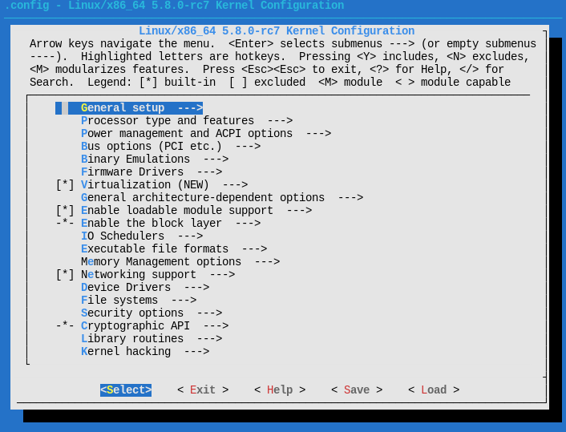

# Kernel

## Create config file

<code>x86_64</code> default config file can be copied from <code>./arch/x86/configs/x86_64_defconfig</code>

```shell
make ARCH=x86_64 x86_64_defconfig
```

Or use <code>menuconfig</code> (need to use xfce4-terminal, bash ):

```shell
make ARCH=x86_64 menuconfig
```

And process relavent option in the following graphic menu:



### Options

#### Debug (using GDB)

Pick the following compiling options:

1. <code>General setup -> Initial RAM filesystem and RAM disk support</code>
2. <code>Device Drivers -> Blockdevices -> RAM block device support</code>, set "number=16" and "size=65536"
3. <code>Kernel hacking -> Compile-times chekcs and compiler options -> Compile the kernel with debug info</code>
4. <code>Kernel hacking -> Compile-times chekcs and compiler options -> Provide GDB scripts for kernel debugging</code>

For the supporting of ramdisk file system and debug.

## Compile kernel

Simply type:

```shell
make
```

to compile kernel, or use multi-thread compilation:

```shell
make -j16
```

where <code>16</code> is the maximum number of threads

(note: do not only type <code>make -j</code>, machine will die)

If succeed, the following will prompt:

```bash
Setup is 13884 bytes (padded to 14336 bytes).
System is 8831 kB
CRC 16fc05a9
Kernel: arch/x86/boot/bzImage is ready  (#1)
```

Compilation result <code>./arch/x86/boot/bzImage</code>, which is a gzip compressed form, and <code>./vmlinux</code>, which is not compressed.

## Clean compiled files

The following clean all compiled files.

```shell
make mrproper
```

# Rootfs

## busybox

### Clone source

Clone the busybox source code from github:

```shell
mkdir busybox
cd busybox
git clone git@github.com:mirror/busybox.git ./
```

### Configure

Same as linux, use menuconfig to select relative settings:

```shell
make menuconfig
```

select <code>Settings -> Build static binary (no shared libs)</code>

Exit and save the config files.

### Compile

Since Arch do not provide static glibc, need to compile and install it in docker:

```shell
docker run -it --rm -e PLAT=manylinux1_x86_64 -v `pwd`:/io quay.io/pypa/manylinux2014_x86_64 /bin/bash
yum update
yum install glibc-static
cd io
make -j16
make install
exit
sudo chown shore ./_install #change owner of the file so that user can manipulate
```

Since we do not save the container, each time will need update and install <code>glibc-static</code>.

By defualt, the installation destination will by <code>./_install</code> 

## Extra file/dirs

Get current directory to <code>path/to/busybox/_install</code> which result from [busybox](#busybox) installation. 

Execute the following to create neccessary file structures:

```shell
mkdir etc dev mnt
mkdir -p etc/init.d/
touch etc/fstab etc/init.d/rcS etc/inittab
cd dev
sudo mknod console c 5 1
sudo mknod null c 1 3
sudo mknod tty1 c 4 1 
```

Fill in <code>./_install/etc/fstab</code> with the following:

```
proc  /proc proc  defaults 0 0
temps /tmp  rpoc  defaults 0 0
none  /tmp  ramfs defaults 0 0
sysfs /sys  sysfs defaults 0 0
mdev  /dev  ramfs defaults 0 0
```

Fill in <code>./_install/etc/init.d/rcS</code> with the following:

```
mkdir -p /proc
mkdir -p /tmp
mkdir -p /sys
mkdir -p /mnt
/bin/mount -a
mkdir -p /dev/pts
mount -t devpts devpts /dev/pts
echo /sbin/mdev > /proc/sys/kernel/hotplug
mdev -s
```

Fill in <code>./_install/etc/inittab</code> with the following:

```
::sysinit:/etc/init.d/rcS
::respawn:-/bin/sh
::askfirst:-/bin/sh
::cttlaltdel:/bin/umount -a -r
```

Finally, change the file attribute of some files:

```shell
chmod 755 etc/inittab
chmod 755 etc/init.d/rcS

```

## Packup runable filesystem

The process summarized as:

1. Create image with <code>ext3</code> format
2. Copy all files under <code>./_install</code> into the image
3. Create a compressed zip file of the target image

Shell operation as follow

```shell
rm -rf rootfs.ext3
rm -rf fs
dd if=/dev/zero of=./rootfs.ext3 bs=1M count=32
mkfs.ext3 rootfs.ext3
mkdir fs
mount -o loop rootfs.ext3 ./fs
cp -rf ./_install/* ./fs
umount ./fs
gzip --best -c rootfs.ext3 > rootfs.img.gz 
```

# Debug

To make it able to debug, need to select [relavent option](#debug-using-gdb) in the config file.

## Compiler optimization

It is said that the code is written based on assuptiom of "-O2" compiler option.

So simply turnoff optimization will cause crash of the whole compilation.

However, it might be possible to add attributo to specific function:

```c
void __attribute__((optimize("O0"))) foo(unsigned char data) {
    // unmodifiable compiler code
}
```

## vscode

Add debug configuration in <code>launch.json</code>:

```json
"configurations": [
   {
      "name": "kernel-debug",
      "type": "cppdbg",
      "request": "launch",
      "miDebuggerServerAddress": "127.0.0.1:1234",
      "program": "输入程序名称，例如 ${workspaceFolder}/vmlinux",
      "args": [],
      "stopAtEntry": false,
      "cwd": "${workspaceFolder}",
      "environment": [],
      "externalConsole": false,
      "MIMode": "gdb",
      "setupCommands": [
            {
               "description": "为 gdb 启用整齐打印",
               "text": "-enable-pretty-printing",
               "ignoreFailures": true
            }
      ]
   }
]
```

## qemu

Run qemu with gdb support, simple sample is as follow:

```shell
qemu-system-x86_64 -S -s -kernel arch/x86/boot/bzImage -initrd ./rootfs.img.gz -append "root=/dev/ram init=/linuxrc" -serial file:output.txt
```

Parameters:
1. <code>-kernel</code>: option providing bzImage as kernel drive without installing into target file system & partitions.
2. <code>-S -s</code>: Setup support for GDB, default port is 1234
3. <code>-initrd</code>: init process directory, which is location of the [rootfs](#rootfs)
4. <code>-append</code>: parameters pass to kernel
5. <code>-serial</code>: Kernel info output file location

Current complete run command for debugging qemu:

```shell
qemu-system-x86_64 -S -s -kernel arch/x86/boot/bzImage -initrd ./rootfs.img.gz -append "root=/dev/ram init=/linuxrc nokaslr" -serial file:output.txt -machine q35 -cpu EPYC -smp 4 -m 1G -device nvme,drive=D22,serial=1234 -drive file=nvme.disk,if=none,id=D22 -accel kvm
```

## GDB

Start gdb and loading linux symbols:

```shell
gdb ./vmlinux
```

Connect to debug port:

```shell
(gdb) target remote:1234
```

Set break point:

```shell
(gdb) break start_kernel
```

Run until the break point with <code>c</code> command, then switch to source layout to view source code:

```shell
(gdb) layout src
```

### GDB commands

#### Break

1. <code>break XXXX</code>: place break point at symbol "XXXX"
2. <code>hbreak *0xXXXX</code>: place hard break point at (virtual) address "0xXXXX"
3. <code>info break</code>: list all break points
4. <code>delete #No</code>: delete break point by "#No" listed in <code>info break</code>

#### Step

1. <code>si</code>: single step for assembly instruction
2. <code>ni</code>: next step for assembly instruction
3. <code>s</code>: single step for source code
4. <code>n</code>: next step for source code
5. <code>c</code>: run untill meet break point

#### View content

1. <code>info r</code>: print registers(including segments)
2. <code>x/nfu addr</code>: n = number, f = format(x=hex), u = len(g=8byte); example: x/16xg $rsp
3. <code>info r</code>: print registers(including segments)
4. <code>display /fmt expr</code>: display the value of "expr" each break with format "/fmt"
   1. <code>/x</code>: hex format
   2. <code>/c</code>: char format
   3. <code>/f</code>: float format
5. <code>p /fmt expr</code>: view the value of "expr" with format "/fmt"

#### Others

1. <code>layout XXXX</code>: use "XXXX" view as layout
   1. <code>r</code>: Assembly view
   2. <code>src</code>: Source code view
2. <code>quit</code>: quit gdb
3. <code>disassmble 0xXXXX,+length</code>: disassmble from address "XXXX" 
4. <code>bt</code>: view calling stack(trace caller of the function)

# Source code

## __raw_cmpxchg(ptr, old, new, size, lock)

### Location

<code>./arch/x86/include/asm/cmpxchg.h</code>

### Parameter

|Name|illustration|
|-|-|
|ptr|Pointer to the target value|
|old|Old value|
|new|new value|
|size|To determine the size (2/4/8) in byte the operation is on|
|lock|Lock preffix, make sure atomic operation|

### Logic

If <code>*ptr == old</code> then <code>*ptr = new</code>

Else <code>old = *ptr</code>

Return <code>old</code>

## arch_atomic_try_cmpxchg_acquire(atomic_t *v, int *old, int new)

### Location

<code>./include/linux/atomic-arch-fallback.h</code>

### Logic

If <code>(int)*v == *old</code> then <code>*v = (atomic_t)new</code>

Else <code>*old = (int)*v</code>

Retrun <code>*v == *old</code>

# Linux command

## stdin/stdout/stderr & redirection

### stdin/stdout/stderr

Standard in/out/error are defualt file descriptors (<code>current->filp[0/1/2]</code>) within linux process structure. While executing command, linux will write(<code>current->filp.write()</code>) standard in/out/error data into 0,1,2 file descriptor respectively.

The defualt of the three are screen. With write(<code>current->filp.write()</code>)  method, the related infomation will be printed on screen.

In command line, the file descriptor 0/1/2 natively named "0,1,2" respectively.

### redirection

<code>a > b</code> : 

1. For file name "a" and "b", locate related file descriptor <code>current->filp[x]</code> and <code>current->filp[y]</code>
2. Make <code>current->filp[x]=current->filp[y]</code>
3. If <code>a=0/1/2</code> means standard in/out/error

<code>a >> b</code> :

1. Similar to <code>a > b</code> but will set data pointer of "b" to <code>EOF</code> (End Of File)
2. More like write append
3. If <code>a=0/1/2</code> means standard in/out/error

<code>a >& b</code> :

1. Similar to <code>a > b</code>
2. If <code>a=0/1/2</code> or <code>b=0/1/2</code> means standard in/out/error

### sample

```shell
nohup java -jar app.jar 1>>log 2>&1
```

Firstly, the above command uses <code>1>>log</code>, according to [redicrection](#redirection), it equals stdout to file "log" and set the data pointer of "log" to <code>EOF</code>.

Secondly, it uses <code>2>&1</code>, according to [redicrection](#redirection), it equals stderr to stdout, which is now file "log".

While executing the command, the programm will:

1. Open file descritptor of stdin/stdout/stderr and "log"
2. Set the data pointer of "log" to <code>EOF</code>
3. Write standard output to "1", which is redirected to file "log"
4. Write standard error to "2", which is redirected to "1" and redirected to "log"

## "&&" and "||"

```shell
command1 && command2 [&& command3 ...]
```

Only execute command on the right when command on the left return true.

```shell
command1 || command2 [|| command3 ...]
```

Only execute command on the right when command on the left return false.

## man

Display mannual for specific linux command.

Example for displaying mannual for <code>ls</code> command

```shell
man ls
```

## dmesg

Display the messages in "kernel-ring buffer", where linux will dump kernel related informations.

<code>-c, --read-clear</code> : Clear the ring buffer after first printing its contents
<code>-C, --clear</code> : Clear the ring buffer 
<code>-s, --buffer-size size</code> : Use  a buffer of size to query the kernel ring buffer.  This is 16392 by default
<code>-n, --console-level level</code> : Set the level at which printing of messages is done to the console

example:

```shell
sudo dmesg | grep DMA
```

## grep

Catch lines from command output that include specific string 

example:

```shell
sudo dmesg | grep DMA
```

## ld

Format as

```shell
ld [options] <obj files>
```

<code>-o</code>: Specify output file name
<code>-l</code>: "lc" same as "-l c", format is "l <namespec>" while in this case <namespec>=c. It tell ld to find "lib<namespec>.a" which in this case "libc.a"

## find

```shell
find path -option [-print]
```

<code>path</code>: Directory to execute search
<code>-print</code>: Output to stdout

### Option

<code>-name</code>: Specify name without leading directory, can use "?" for one uncertain character and "*" for uncertain string.
<code>-path</code>: Specify the whole directory (includeing file name & leading directory) pattern for search
<code>-type</code>: "b/d/c/p/l/f" stand for "block device, directory, character device, normal files"
<code>\<expr1\> -a \<expr2\></code>: <code>\<expr2\></code> only valued if <code>\<expr1\></code> return true
<code>\<expr1\> -o \<expr2\></code>: <code>\<expr2\></code> only valued if <code>\<expr1\></code> return false
<code>!\<expr\></code>:  return inverse of <code>\<expr\></code>
<code>-prune</code>: If the file is a directory, descend into it.

The following example:

```shell
find ~/OneDrive -path ~/OneDrive/manjaro_note -a -prune -o -name *.org -a -print
```

will first:

1. Only "~/OneDrive/manjaro_note" match <code>-path</code>, return ture
2. <code>-a</code> indicating execute <code>-prune</code> when found is "~/OneDrive/manjaro_note"
3. <code>-prune</code> return true since "~/OneDrive/manjaro_note" is a directory, and do not descend into it.
4. <code>-o</code> will not execute only if <code>-path ~/OneDrive/manjaro_note -a -prune</code> is false
5. <code>-name</code> match the filename.

In conclusion, <code>-path ~/OneDrive/manjaro_note -a -prune</code> return ture only if what found is "~/OneDrive/manjaro_note" and stop search any files under the direcotry. Other files not in "~/OneDrive/manjaro_note" will be valued by <code>-name *.org</code> and if true, will be printed.
 
# gcc

Format as

```shell
gcc [options] <source files>
```

<code>-m64</code>: Set int to 32 bits, long & pointer to 64 bits, generate x86_64 architechture
<code>-c</code>: Compile but do not link, create .o files
<code>-g</code>: Compile with debug information
<code>-o</code>: Specify output file name
<code>-fPIC</code>: If supported for the target machine, produce position-independent code
<code>-fvisibility=[default|internal|hidden|protected]</code>: Set the defualt attribute for export table of executable, can be overridden by <code>\_\_attribute__ ((visibility("default|internal|hidden|protected")))</code> within source codes.
<code>-z muldefs</code> Allow multiple definition
<code>-s</code>Remove all symbol table and relocation information from the executable.