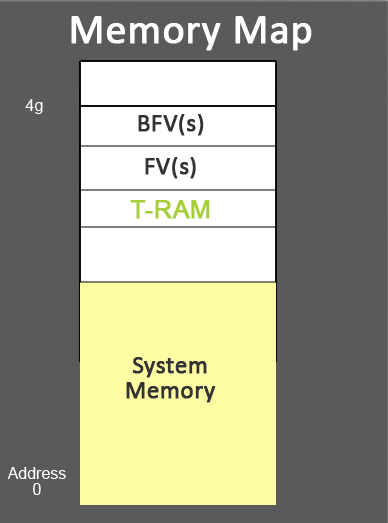
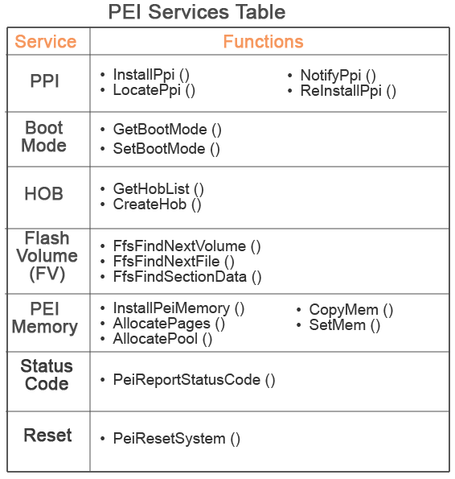

# Installing EDK2

## Pre-requiements

EDK2 requires packages including but not limite to

```shell
nasm acpica base-devel glibc
```

more infomation need to refer to [official site](https://github.com/tianocore/tianocore.github.io/wiki/Using-EDK-II-with-Native-GCC#See_Also).

## Setting up

From this [link](https://github.com/tianocore/tianocore.github.io/wiki/Common-instructions) describes the steps to follow and setup edk2 enviroment for UEFI deveopment.

### Setup steps

1. Clone repo with latest stable [tag](https://github.com/tianocore/edk2/tags)
   ```shell
   git clone https://github.com/tianocore/edk2 <latest-tag>
   ```
2. Initialize submodules
   ```shell
   cd edk2*
   git submodule update --init
   ```
3. Compile build tools
   ```shell
   make -C BaseTools
   . edksetup.sh
   ```
4. Setup build shell environment (allow build command in bash)
   ```shell
   export EDK_TOOLS_PATH=$HOME/src/edk2/BaseTools
   . edksetup.sh BaseTools
   ```

### Build sample

Under <code>edk2</code> directory open <code>./Conf/target.txt</code> make change to the following lines:

```shell
ACTIVE_PLATFORM       = MdeModulePkg/MdeModulePkg.dsc
TOOL_CHAIN_TAG        = GCC5
TARGET_ARCH           = X64
```

Supported development "TOOL_CHAIN_TAG" are listed in <code>./${WORKSPACE}/BaseTools/Conf/tools_def.template</code> under "Supported Tool Chains" section.

Setup shell enviroment by:

```shell
. edksetup.sh BaseTools
```

In terminal, simply type:

```shell
build
```

If the following text appears, indicating a successful build:

```shell
- Done -
Build end time: 14:03:44, Aug.19 2020
Build total time: 00:00:27
```

## Build & run OVFM

### Build

References are with this [link](https://github.com/tianocore/tianocore.github.io/wiki/How-to-build-OVMF).

To build <code>OVFM</code> modual, update <code>./Conf/target.txt</code> make change to the following lines:

```shell
ACTIVE_PLATFORM       = OvmfPkg/OvmfPkgX64.dsc
TOOL_CHAIN_TAG        = GCC5
TARGET_ARCH           = X64
```

Then, simply type <code>build</code> command, and the following ending will indicating a successful build.

```shell
- Done -
Build end time: 14:38:42, Aug.19 2020
Build total time: 00:00:48
```

The target <code>OVMF.fd</code> will be under <code>./Build/OvmfX64/DEBUG_GCC5/FV/OVMF.fd</code> directory.

### run

References are with this [link](https://github.com/tianocore/tianocore.github.io/wiki/How-to-run-OVMF).

To run QEMU with UEFI shell, add the following options to the original running command:

```shell
-bios ~/src/edk2/Build/OvmfX64/DEBUG_GCC5/FV/OVMF.fd -net none
```

If QEMU cannot find bootable device, it will enter into UEFI shell.

# GPT partition

## LBA[0] (Protective MBR)

Sector 0 (1st sector) of the disk, MBR for BIOS mode.

Only contain 1 partition, type as 0xEE, size would be minimum of disk size and 2TB.

The main function of this sector is to fake GPT partition into a unrecogizable to tools that do not config GTP partition, in order to block format or re-partition operations from them.

Actually not used by UEFI. Struacture as follow:

|Symbol|Offset(byte)|len|Description|
|-|-|-|-|
|BootIndicator|446|1|N/A|
|StartingCHS|447|3|0x000200|
|OSType|450|1|0xEE|
|EndingCHS|451|3|Set to the CHS address of the last logical block on the disk. Set to 0xFFFFFF if it is not possible to represent the value in this field.|
|StartingLBA|454|4|0x00000001|
|SizeInLBA|458|4|Set to the size of the disk minus one. Set to 0xFFFFFFFF if the size of the disk is too large to be represented in this field.|

## LBA[1] (GPT_header)

|Symbol|Offset(byte)|len|Description|
|-|-|-|-|
|Signature|0|8|Must be ASCII“EFI PART” (0x5452415020494645 in hex)|
|Revision|8|4|Version of GPT, current is 1.0 (0x00010000 in hex)|
|HeaderSize|12|4|Size in bytes of the GPT header. Must within 92 and sector size|
|HeaderCRC32|16|4|CRC32 checksum for GPT Header structure|
|Reserved|20|4|Must be zero|
|MyLBA|24|8|The LBA that contains GPT header (which is LBA 1)|
|AlternateLBA|32|8|LBA address of the alternate GPT Header (Which is last LBA)|
|FirstUsableLBA|40|8|First LBA can be used by a partition|
|LastUsableLBA|48|8|Last LBA can be used by a partition|
|DiskGUID|56|16|GUID of the disk|
|PartitionEntryLBA|72|8|The starting LBA of the GUID Partition Entry array|
|NumberOfPartitionEntries|80|4|The number of Partition Entries in the GUID Partition Entry array|
|SizeOfPartitionEntry|84|4|The size, in bytes, of each the GUID Partition Entry structures in the GUID Partition Entry array|
|PartitionEntryArrayCRC32|88|4|CRC32 checksum for partition entry array|
|Reserved|92|BlockSize-92|Must be zero|

## Partition array

From <code>PartitionEntryLBA</code> to <code>PartitionEntryLBA + NumberOfPartitionEntries * SizeOfPartitionEntry</code>.

Each entry with the following layout:

|Symbol|Offset(byte)|len|Description|
|-|-|-|-|
|PartitionTypeGUID|0|16|GUID of partition type|
|UniquePartitionGUID|16|16|GUID that is unique for every partition entry|
|StartingLBA|32|8|Starting LBA of the partition|
|EndingLBA|40|8|Ending LBA of the partition|
|Attributes|48|8|Attribute bits|
|PartitionName|56|72|Null-terminated string|
|Reserved|128|SizeOfPartitionEntry-128|must be zero|

Regular <code>PartitionTypeGUID</code> are list in the table below:

|Type|GUID|
|-|-|
|EFI System Partition|C12A7328-F81F-11D2-BA4B-00A0C93EC93B|
|Partition Containing a legacy MBR|024DEE41-33E7-11D3-9D69-0008C781F39F|
|FAT12/16/32/NTFS|EBD0A0A2-B9E5-4433-87C0-68B6B72699C7|
|EXT4|0FC63DAF-8483-4772-8E79-3D69D8477DE4|

<code>Attributes</code> are 

|Bit|Symbol|Description|
|-|-|-|
|Bit 0|Required Partition|If this bit is set, the partition is required for the platform to function|
|Bit 1|No Block IO Protocol|If this bit is set, then firmware must not produce an EFI_BLOCK_IO_PROTOCOL device for this partition|
|Bit 2|Legacy BIOS Bootable|if set indicating Legacy BIOS bootable|
|Bits 3-47|N/A|must be zero|
|Bits 48-63|N/A|Reserved for GUID specific use|

# UEFI Booting stages

## Pre-UEFI

### Hardware init

Hardware init inclduing:

1. CPU hardware initilization
2. CPU self check
3. CPU execute first code

After the previus steps, CPU is in real mode and registers are set and ready to execute first instruction.

Different CPU may have different values for registers, but some of the important as follow should be the same:

|Reg|Val|
|-|-|
|IP|0xFFF0|
|CS|0xF000|
|CS.BASE|0xFFFF0000|

### Locate first instruction

<code>CS.BASE</code> is a hidden register that used to store the value <code>$CS<<4</code>, so that each time CPU addressing do not need to calculate CS to save time.

<code>CS.BASE</code> only change when writing new values to <code>CS</code>, and the actual addressing are <code>\$CS.BASE + $IP</code>.

Thus, after hardware initialization, due to the disalignment of <code>CS</code> and <code>CS.BASE</code>, the actual address of the first code is <code>\$CS.BASE + $IP = 0xFFFF0000 + 0xFFF0 = 0xFFFFFFF0</code>

### Boot firmware

BIOS ROM which containing firmware will be mapped to memory address <code>0xFFFFFFFF - firmware size</code> to <code>0xFFFFFFFF</code>.

Thus the first instruction CPU will execute are within the range of firmware, from that the UEFI resetvector take over the control of CPU and start software initialization.

For the firmware structrue of UEFI, see [.fdf](#fdf) section.

## SEC(Security)

First code after boot or reset, ensure firmware integrity is intact.

1. Handling restart events
2. Create temporary memory ([T-RAM](#tram))
3. Initial code take control of the system
4. Transfering control to [PEI](#peipre-efi)

## PEI(Pre-efi)

Initialize memory & other platform resources to allow DEX(next stage) to run in C enviroment.

1. Discover boot mode
2. Locate, validate and dispatch PEI modules(PEIM)
3. Publish PEIM-to-PEIM interface
4. Initialize memory
5. Dicover and run DXE core
6. Convey platfomr infomation into DEX

PEI is excuted from ROM(Read Only Memory), containing [PEI Core](#pei-core), [PEI-Modual](#pei-module-peim) and [Inter-PEIM call table](#inter-peim-call-table-ppi).

### PEI memroy

PEI core need temporary memory to run. For IA32 sample implementation, 8KB is required.

To satisfy the memroy requirement by PEI, CPU provide its cache as RAM.

The following shows the PEI memory map:



|Block|Description|
|-|-|
|<a id="bfmwar">BFV</a>|stores PEI core code|
|<a id="fmwar">FV</a>|stores firmware data & code|
|<a id="tram">T-RAM</a>|PEI's temprary memory for stack before system memory initialized|
|System memory|PEI will discover and initialize it|

### PEI module (PEIM)

Moduals saperatly built, run on flash device (not load into memory).

Defines [PPI](#inter-peim-call-table-ppi) for other PEIMs and its own PPI needs.

#### Inter-PEIM call table (PPI)

Located in PPI-database, provide services and capability to other PEIMs.

### PEI service

Define as capability used by [PEIM](#pei-module-peim)s.

PEI fundation will establish PEI Service Table, which is a table structure that contains list of function pointers as PEI service.

Since [T-RAM](#tram) is not known, the table pointer will be passed into each [PEIM](#pei-module-peim) and [PPI](#inter-peim-call-table-ppi).



### PEI Core

Main PEI executable binary located in [BFV](#bfmwar) which execute the following steps:

#### Initialization

Initialize [PEI core services](#pei-service)

#### Dispatcher

Search [FV](#fmwar) for [PEIM](#pei-module-peim)s and run them if the following 2 are both satisfied:

1. DEPEX algorithm evaluate as true
2. File authentication states true

PEIMs will establish [PPI](#inter-peim-call-table-ppi)s and execute their entry code.

One PEIM will ultimatly initialze system memories, and then another PEIM called "DEX IPL" will transfer to [DEX](#dex) stage.

## DEX

## BDS

## TSL

## RT

## AL

# Build files

For GUID generation, [online](https://www.guidgen.com/) web can be used.

## .dec

Declaration file format

All standard output head files, library classes, protocol, GUID and other objects can be referecned in other [module](#inf) or [package](#dsc) that provided by this package should be declared in this file.

### [Defines] (Required.dec)

Sample as follow:

```shell
[Defines] 
    DEC_SPECIFICATION = 0x0001001B
    PACKAGE_NAME      = MyPkg
    PACKAGE_GUID      = 266f7704-e15b-4eab-bfb3-570d5f186b15
    PACKAGE_VERSION   = 0.1
```

Some of the important definitions:

|Field|Necessity|Description|
|-|-|-|
|DEC_SPECIFICATION|Required|The specification version of <code>.dec</code> file format version. [Current release](https://edk2-docs.gitbook.io/edk-ii-dec-specification/3_edk_ii_dec_file_format/34_-defines-_section) is 1.27 (0x0001001B in hex).|
|PACKAGE_GUID|Required|GUID of the package, need to be unique inside the project.|
|PACKAGE_VERSION|Required|String indicating the package version. Used for maintaince, can be ignored.|
|PACKAGE_NAME|Required|Same name as the package dir, may be used for creating directories.|

### [Includes] (optional.dec)

Identify the "standard" location "include directories" provide by this EDK II package for head files (.h).

Usually used as <code>Includes.\$(Arch)</code>, <code>\$(Arch)</code> can be IA32, X64 or others.

Thus different build options will use difference head files.

The following are one of the sample:

```shell
[Includes.common]
   Include # Includes for all processor architectures

[Includes.IA32]
   Include/Ia32 # Includes specific to IA32

[Includes.X64]
   Include/X64 # Includes specific to X64

[Includes.EBC]
   Include/Ebc # Includes specific to EBC

[Includes.ARM]
   Include/Arm # Includes specific to ARM
```

### [LibraryClasses] (optional.dec)

Declare a library class with its head file.

The declared library class can be furthre refereced:
1. By other [module](#inf) in [LibraryClasses](#libraryclasses-optionalinf) section
2. By other [Package](#dsc) in [LibraryClasses](#libraryclasses-optionaldsc) section

The format for each entry is: <code>LibraryClassName | Relative/path/and/header_filename.h</code>

The following is a sample:

```shell
[LibraryClasses]
  UefiRuntimeServicesTableLib |Include/Library/UefiRuntimeServicesTableLib.h
  UefiLib | Include/Library/UefiLib.h
  UefiDriverModelLib | Include/Library/UefiDriverModelLib.h
  UefiDriverEntryPoint | Include/Library/UefiDriverEntryPoint.h
  UefiDecompressLib | Include/Library/UefiDecompressLib.h
  UefiBootServicesTableLib | Include/Library/UefiBootServicesTableLib.h
  TimerLib|Include/Library/TimerLib.h
  SmbusLib|Include/Library/SmbusLib.h
  ResourcePublicationLib|Include/Library/ResourcePublicationLib.h
  PostCodeLib|Include/Library/PostCodeLib.h
  ReportStatusCodeLib|Include/Library/ReportStatusCodeLib.h
  PrintLib|Include/Library/PrintLib.h
  PerformanceLib|Include/Library/PerformanceLib.h
  PeiServicesTablePointerLib|Include/Library/PeiServicesTablePointerLib.h
  PeimEntryPoint|Include/Library/PeimEntryPoint.h
  PeiServicesLib|Include/Library/PeiServicesLib.h
  PeiCoreEntryPoint|Include/Library/PeiCoreEntryPoint.h
  PeCoffLib|Include/Library/PeCoffLib.h
  BaseLib|Include/Library/BaseLib.h

[LibraryClasses.IA32]
  UefiApplicationEntryPoint |Include/Library/UefiApplicationEntryPoint.h # UEFI_APPLICATION

[LibraryClasses.X64]
  UefiApplicationEntryPoint|Include/Library/UefiApplicationEntryPoint.h # UEFI_APPLICATION

[LibraryClasses.EBC]
  UefiApplicationEntryPoint|Include/Library/UefiApplicationEntryPoint.h # UEFI_APPLICATION
```

### [Protocols] (optional.dec)

This section is used to define a global pointer C variable pointed to the GUID Value of a Protocol. 

Format as <code>ProtocolCName = {C Format Guid Value} # Comment</code>.

Any module that refereced the <code>ProtocolCName</code> in [Protocols](#protocols-optionalinf) section in [inf](#inf) file can use the pointer variable in .c files. With proper service, a specific [protocol](#protocol) can be located and used.

Sample as follow:

```shell
[Protocols.common]
gEfiWinNtThunkProtocolGuid = { 0x58C518B1, 0x76F3, 0x11D4,{ 0xBC, 0xEA, 0x00, 0x80, 0xC7, 0x3C, 0x88, 0x81 }}
gEfiWinNtIoProtocolGuid    = { 0x96EB4AD6, 0xA32A, 0x11D4,{ 0xBC, 0xFD, 0x00, 0x80, 0xC7, 0x3C, 0x88, 0x81 }}
```

### [Guids] (Optional.dec)

Define the GUID Value for GUID C Names. Format as <code>GuidCName = {C Format Guid Value} # Comment</code>

Any module that refereced the <code>GuidCName</code> in [Guids](#guids-optionalinf) section in [inf](#inf) file can use the <code>GuidCName</code> as its GUID value in .c files.

## .dsc

### [Defines] (Required.dsc)

Sample as follow:

```shell
[Defines]
    DSC_SPECIFICATION       = 0x0001001C
    PLATFORM_GUID           = 62f4f74c-3951-4ada-b58c-1d3f4bd6a865
    PLATFORM_VERSION        = 0.1
    PLATFORM_NAME           = My
    SKUID_IDENTIFIER        = DEFAULT
    SUPPORTED_ARCHITECTURES = X64
    BUILD_TARGETS           = DEBUG|RELEASE
```

Some of the important field:

|Field|Necessity|Description|
|-|-|-|
|DSC_SPECIFICATION|Required|The specification version of <code>.dsc</code> file format version.[Current release](https://edk2-docs.gitbook.io/edk-ii-dsc-specification/3_edk_ii_dsc_file_format/35_-defines-_section) is 1.28 (0x0001001C in hex).|
|PLATFORM_GUID|Required|GUID of the platform, need to be unique inside the project.|
|PLATFORM_VERSION|Required|String value for version.|
|PLATFORM_NAME|Required|Used for default output dir as <code>\$(WORKSPAE)/Build/\$(PLATFORM_NAME)</code>|
|SKUID_IDENTIFIER|Required|Just set <code>SKUID_IDENTIFIER = DEFAULT</code> for now.|
|SUPPORTED_ARCHITECTURES|Required| "\|" saperated supported architectures, such as X64, IA32 and .etc|
|BUILD_TARGETS|Require|"\|" saperated build targets, such as DEBUG or RELEASE|
|FLASH_DEFINITION|optional|Indicating <code>.fdf</code> file dir for building firmware.|

### [LibraryClasses] (optional.dsc)

List of library class that is:
1. Declared in [LibraryClasses](#libraryclasses-optionaldec) section of [dec](#dec) files; and
2. Will be used for modules within this package; or
3. Is the dependency of library clases that used in this package

The format for each entry is: <code>LibraryClassName | Relative/path/and/inf_filename.inf</code>.

Note: if other library classes are referenced in <code>.inf</code> files, relative entries also need to be listed in here, otherwise build error.

Sample as follow:

```shell
[LibraryClasses]
    UefiLib|MdePkg/Library/UefiLib/UefiLib.inf
    UefiApplicationEntryPoint|MdePkg/Library/UefiApplicationEntryPoint/UefiApplicationEntryPoint.inf
    MemoryAllocationLib|MdePkg/Library/UefiMemoryAllocationLib/UefiMemoryAllocationLib.inf
    PrintLib|MdePkg/Library/BasePrintLib/BasePrintLib.inf
    PcdLib|MdePkg/Library/BasePcdLibNull/BasePcdLibNull.inf
    DebugLib|MdePkg/Library/BaseDebugLibNull/BaseDebugLibNull.inf
    BaseMemoryLib|MdePkg/Library/BaseMemoryLib/BaseMemoryLib.inf
    BaseLib|MdePkg/Library/BaseLib/BaseLib.inf
    UefiBootServicesTableLib|MdePkg/Library/UefiBootServicesTableLib/UefiBootServicesTableLib.inf
    DevicePathLib|MdePkg/Library/UefiDevicePathLib/UefiDevicePathLib.inf
    UefiRuntimeServicesTableLib|MdePkg/Library/UefiRuntimeServicesTableLib/UefiRuntimeServicesTableLib.inf
```

### [Components] (Required)

List the relative dir of modules' [.inf](#inf) files, so that it can be included in the package and built.

Sample as follow：

```shell
[Components]
    MyPkg/test/test.inf
```

### [BuildOptions] (optional)

Compile options, apply to all build target listed in [Components](#components-required) section.

Few types are listed here:

1. <code>\${FAMILY}: \${TARGET}\_\${TAGNAME}_ \${ARCH}_\${TOOLCODE}_FLAGS</code>
   Add compiling flags for specific building options
2. <code>\${FAMILY}: \${TARGET}\_\${TAGNAME}_ \${ARCH}_\${TOOLCODE}_PATH</code>
   Replace compiling command for specific building options
3. <code>\${FAMILY}: \${TARGET}\_\${TAGNAME}\_\${ARCH}\_\${TOOLCODE}_DPATH</code>
   Add path to enviroment PATH for specific building options
4. <code>\${FAMILY}: \${TARGET}\_\${TAGNAME}\_\${ARCH}\_\${TOOLCODE}\_\${ATTRIBUTE}</code>
   This permits overriding other attributes if required

The variables such as <code>\${FAMILY}:</code> are defined in the following table:

|Variable|Required|Wildcard|Source|
|-|-|-|-|
|FAMILY|NO|No|Conf/tools_def.txt defines FAMILY as one of MSFT, INTEL or GCC. Typically, this field is used to help the build tools determine whether the line is used for Microsoft style Makefiles or the GNU style Makefiles.|
||||By not specifying the FAMILY, the tools assume the flags are applicable to all families.|
|TARGET|YES|Yes = *|Conf/tools_def.txt file defines two values:|
||||DEBUG and RELEASE. Developers may define additional targets.|
|TAGNAME|YES|Yes = *|Conf/tools_def.txt file defines several different tag names - these are defined by developers; the default tag name, MYTOOLS, is provided in the template for tools_def.txt and set in the Conf/target.txt file.|
|ARCH|YES|Yes = *|Conf/tools_def.txt defines six architectures:|
||||ARM, AARCH64, IA32, X64 and EBC. This tag must use all capital letters for the tag. Additional Architectures, such as PPC may be added as support becomes available.|
|TOOLCODE|YES|NO|The tool code must be one of the defined tool codes in the Conf/tools_def.txt file. The flags defined in this section are appended to flags defined in the tools_def.txt file for individual tools.|
||||EXCEPTION: If the INF MODULE_TYPE, defined in the [Defines] section is USER_DEFINED, then the flags listed in this section are the only flags used for the|
||||TOOLCODE command specified in Conf/tools_def.txt`.|
|ATTRIBUTE|YES|NO|The attribute must be specific to the tool code and must be a valid attribute handled by the build system. For the reference build, a valid rule must be included in the build_rule.txt.|

## .fdf

### [Defines]

Used to define MACRO values that will be replaced in the following content of the file.

Use <code>SET NAME = VALUE</code> to define macros, also <code>!ifdef, !ifndef, !if, !elseif, !else and !endif</code>

Sample as follow:

```shell
[Defines]
!if $(TARGET) == RELEASE
!ifndef $(FD_SIZE_2MB)
   DEFINE FD_SIZE_1MB=
!endif
!endif
!include OvmfPkg.fdf.inc

SET gEfiMdeModulePkgTokenSpaceGuid.PcdFlashNvStorageFtwSpareSize = 0x1000
```

## .inf

This file is used for building modules, list out including references and building options.

### [Defines]

Sample as

```shell
[Defines]
   INF_VERSION                    = 0x00010005
   BASE_NAME                      = UefiMemoryAllocationLib
   MODULE_UNI_FILE                = UefiMemoryAllocationLib.uni
   FILE_GUID                      = 4674739d-3195-4fb2-8094-ac1d22d00194
   MODULE_TYPE                    = UEFI_DRIVER
   VERSION_STRING                 = 1.0
   LIBRARY_CLASS                  = MemoryAllocationLib|DXE_DRIVER DXE_RUNTIME_DRIVER DXE_SMM_DRIVER UEFI_APPLICATION UEFI_DRIVER
```

Some of the important definitions:
|Field|Necessity|Description|
|-|-|-|
|INF_VERSION|Required|The specification version of <code>.inf</code> file format version.[Current release](https://edk2-docs.gitbook.io/edk-ii-inf-specification/3_edk_ii_inf_file_format/34_-defines-_section) is 1.27 (0x0001001B in hex).|
|BASE_NAME|Required|Name of the module.Will be used as default directory of built module|
|FILE_GUID|Required|GUID of the module, need to be unique.|
|MODULE_TYPE|Required|Type of build, <code>UEFI_APPLICATION</code> for normal applications|
|ENTRY_POINT|Optional|First function that will be execute in the module|
|LIBRARY_CLASS|Optional|Formate as <code>NAME \| SUPPORTED_MODULE_TYPE1 SUPPORTED_MODULE_TYPE2</code>, can have multiple definitions.|

One module can have multiple library class such as:

```shell
LIBRARY_CLASS = FOO | PEI_CORE PEIM
LIBRARY_CLASS = BAR | DXE_CORE DXE_DRIVER DXE_SMM_DRIVER
```

Indicating this module is the actual instance of the library class.

Any other packages references the listed library class need to associate this [inf](#inf) file in [LibraryClasses](#libraryclasses-optionaldsc) section of [dsc](#dsc) file. 

### [LibraryClasses] (optional.inf)

Lists of library classes referenced by this module.

### [Protocols] (optional.inf)

List of referenced global pointer variables' C name that pointed to the GUID of needed protocols.

### [Guids] (optional.inf)

List of referenced global variables' C name that contains the target GUID values.

# protocol

## Basic structure

During [boot](#dex) process, UEFI will register each device (hardware) as an <a id="controller">controller</a> (treated as an object), and package each driver as protocol to provide unified service calling procedures.

<span style="color:red">protocol itself is a structure</span>, within which contains function pointer as <span style="font-weight:bold">method</span> and variables as <span style="font-weight:bold">property</span>.

Each protocol has a unique GUID defined as <code>EFI_GUID</code>, and a global pointer varible <code>EFI_GUID *</code> that point at this GUID. 

The name of pointer variable are unified as <code>g + Efi + Protocol name + ProtocolGuid</code>. It must be:
1. Decleared in [Protocols](#protocols-optionaldec) section of package's [dec](#dec) file.
2. Referenced in [Protocols](#protocols-optionalinf) section of package's [inf](#inf) file.

So that the pointer can be used in the module to locate a protocol struct.

## Protocol related code

Each object set up within UEFI will be maintained by <code>typedef void *EFI_HANDLE</code> pointer defined in [UefiBaseType.h](./edk2-stable202005/MdePkg/Include/Uefi/UefiBaseType.h).

Previous mentioned [controller](#controller) also going to be managed and maintained by <code>EFI_HANDLE</code> pointer. <code>EFI_HANDLE</code> will be transfered into [IHANDLE](#ihandle) structure for further operations.

### Lists of Protocols

There are 2 basic list related to UEFI protocols:

<a id="handleDB"></a><span style="color:blue">List-1</span>: First empty node as <code>gHandleList</code>, following by <code>AllHandles</code> member of [IHANDLE](#ihandle). This is the database for handles.

<a id="protocolDB"></a><span style="color:blue">List-2</span>: First empty node as <code>mProtocolDatabase</code>, following by <code>AllEntries</code> member of [PROTOCOL_ENTRY](#protocol_entry). This is the database for protocols.

Each [PROTOCOL_ENTRY](#protocol_entry) had <code>ProtocolID</code> as unique GUID so that it can be identified within the list. However, each [PROTOCOL_ENTRY](#protocol_entry) can establish multiple [PROTOCOL_INTERFACE](#protocol_interface), therefore:

<span style="color:blue">List-3</span>: First empty node as <code>Protocols</code> member of [PROTOCOL_ENTRY](#protocol_entry), following by <code>ByProtocol</code> member of [PROTOCOL_INTERFACE](#protocol_interface).

Each [IHANDLE](#ihandle) must contain 1 or more [PROTOCOL_INTERFACE](#protocol_interface) that belongs to itselt, thus:

<span style="color:blue">List-4</span>: First empty node as <code>Protocols</code> member of [IHANDLE](#ihandle), following by <code>Link</code> member of [PROTOCOL_INTERFACE](#protocol_interface).

Each [PROTOCOL_INTERFACE](#protocol_interface) must be unique in specific object. To avoid re-open already opened [PROTOCOL_INTERFACE](#protocol_interface) in the same object, a check list need to be maintained. Thus:

<span style="color:blue">List-5</span>: First empty node as <code>OpenList</code> member of [PROTOCOL_INTERFACE](#protocol_interface), following by <code>Link</code> member of [OPEN_PROTOCOL_DATA](#open_protocol_data).

<span style="color:red">There also would be a notify link, which need to be illustrated in the furture.</span>

### Structures 

#### IHANDLE

```c
typedef struct {
  UINTN               Signature;
  // All handles list of IHANDLE
  LIST_ENTRY          AllHandles;
  // List of PROTOCOL_INTERFACE's for this handle
  LIST_ENTRY          Protocols;
  UINTN               LocateRequest;
  // The Handle Database Key value when this handle was last created or modified
  UINT64              Key;
} IHANDLE;
```

|Member|Description|
|-|-|
|AllHandles|List link all <code>IHANDLE</code> object|
|Protocols|List linked all <code>PROTOCOL_INTERFACE</code> this <code>EFI_HANDLE</code> provides|

#### PROTOCOL_INTERFACE

```c
typedef struct {
  UINTN                       Signature;
  /// Link on IHANDLE.Protocols
  LIST_ENTRY                  Link;
  /// Back pointer
  IHANDLE                     *Handle;
  /// Link on PROTOCOL_ENTRY.Protocols
  LIST_ENTRY                  ByProtocol;
  /// The protocol ID
  PROTOCOL_ENTRY              *Protocol;
  /// The interface value
  VOID                        *Interface;
  /// OPEN_PROTOCOL_DATA list
  LIST_ENTRY                  OpenList;
  UINTN                       OpenListCount;

} PROTOCOL_INTERFACE;
```

|Member|Description|
|-|-|
|Handle|Pointer to [IHANDLE](#ihandle) that contains this PROTOCOL_INTERFACE|
|Protocol|Pointer to [PROTOCOL_ENTRY](#protocol_entry)|
|Interface|Pointer to the actual protocol structure|
|OpenList|List links all [OPEN_PROTOCOL_DATA](#open_protocol_data) by this interface|
|OpenListCount|Numbers of OpenList linked by this interface|

#### PROTOCOL_ENTRY

```c
typedef struct {
  UINTN               Signature;
  /// Link Entry inserted to mProtocolDatabase
  LIST_ENTRY          AllEntries;
  /// ID of the protocol
  EFI_GUID            ProtocolID;
  /// All protocol interfaces
  LIST_ENTRY          Protocols;
  /// Registerd notification handlers
  LIST_ENTRY          Notify;
} PROTOCOL_ENTRY;
```
|Member|Description|
|-|-|
|EFI_GUID|The unique GUID of the protocol|
|AllEntries|List links all protocols|
|Protocols|List links all [PROTOCOL_INTERFACE](#protocol_interface) under this protocol|

#### OPEN_PROTOCOL_DATA

```c
typedef struct {
  UINTN                       Signature;
  ///Link on PROTOCOL_INTERFACE.OpenList
  LIST_ENTRY                  Link;

  EFI_HANDLE                  AgentHandle;
  EFI_HANDLE                  ControllerHandle;
  UINT32                      Attributes;
  UINT32                      OpenCount;
} OPEN_PROTOCOL_DATA;
```

|Member|Description|
|-|-|
|AgentHandle & ControllerHandle|Used to identify unique object opened this [PROTOCOL_INTERFACE](#protocol_interface)|
|Attributes|Used to identify the method of open|
|OpenCount|Times of open in specific object by specific Attributes|

## Use of Protocols

### Find protocol Struct

By the following functions, it is possible to locate a pointer to the protocol struct:

#### OpenProtocol

Definition of the service:

```c
typedef
EFI_STATUS (EFIAPI *EFI_OPEN_PROTOCOL)(
   IN  EFI_HANDLE                Handle,
   IN  EFI_GUID                  *Protocol,
   OUT VOID                      **Interface, OPTIONAL
   IN  EFI_HANDLE                AgentHandle,
   IN  EFI_HANDLE                ControllerHandle,
   IN  UINT32                    Attributes
);
```

|Parameter|Description|
|-|-|
|Handle & *Protocol|Function search <code>([IHANDLE](#ihandle))Handle->Protocols</code> list and locate [PROTOCOL_INTERFACE](#protocol_interface) by matching GUID with *Protocol|
|AgentHandle & ControllerHandle|Used to check if it has already opened in specific object by matching parameters to [OPEN_PROTOCOL_DATA](#open_protocol_data) list in [PROTOCOL_INTERFACE](#protocol_interface)|
|**Interface|Returning pointer to protocol structure|
|Attributes|Attributes of openning|

This method will:
1. Validation of parameters
2. Search [PROTOCOL_INTERFACE](#protocol_interface) linked by <code>(IHANDLE)Handle->Protocols</code>, find target protocol by matching <code>[PROTOCOL_INTERFACE](#protocol_interface)->Protocol->ProtocolID</code>. 
   If no match, <span style="color:purple">return</span> error, else continue.
3. Matching [OPEN_PROTOCOL_DATA](#open_protocol_data) linked by <code>[PROTOCOL_INTERFACE](#protocol_interface)->OpenList</code> by <code>AgentHandle</code> and <code>ControllerHandle</code> parameter.
   If match found, set <code>Interface</code> parameter to point at protocol structure and <span style="color:purple">return</span>, else continue.
4. If not matched [OPEN_PROTOCOL_DATA](#open_protocol_data) found, create one and insert into <code>[PROTOCOL_INTERFACE](#protocol_interface)->OpenList</code>
5. Set <code>*Interface = [PROTOCOL_INTERFACE](#protocol_interface)->Interface</code> parameter to point at protocol structure and <span style="color:purple">return</span>.

#### HandleProtocol

Definition of the service:

```c
typedef
EFI_STATUS (EFIAPI *EFI_HANDLE_PROTOCOL)(
   IN  EFI_HANDLE               Handle,
   IN  EFI_GUID                 *Protocol,
   OUT VOID                     **Interface
);
```

Same as [OpenProtocol](#openprotocol), using <code>gDxeCoreImageHandle</code> and <code>NULL</code> to replace "AgentHandle" and <code>ControllerHandle</code> parameters. Source code as follow:

```c
EFI_STATUS
EFIAPI
CoreHandleProtocol (
  IN EFI_HANDLE       UserHandle,
  IN EFI_GUID         *Protocol,
  OUT VOID            **Interface
  )
{
  return CoreOpenProtocol (
          UserHandle,
          Protocol,
          Interface,
          gDxeCoreImageHandle,
          NULL,
          EFI_OPEN_PROTOCOL_BY_HANDLE_PROTOCOL
          );
}
```

#### LocateProtocol

Definition of the service:

```c
typedef
EFI_STATUS (EFIAPI *EFI_LOCATE_PROTOCOL)(
   IN  EFI_GUID  *Protocol,
   IN  VOID      *Registration, OPTIONAL
   OUT VOID      **Interface
);
```

|Parameter|Description|
|-|-|
|*Protocol|Search [protocol DataBase](#protocolDB) for matching GUID|
|**Interface|Returning <code>[PROTOCOL_INTERFACE](#protocol_interface)->Interface</code> of the first entry in <code>[PROTOCOL_ENTRY](#protocol_entry)->Protocols</code>|

This method will :
1. Loop match [protocol DataBase](#protocolDB) by GUID, start from <code>mProtocolDatabase</code>;
2. If match found, locate first [PROTOCOL_INTERFACE](#protocol_interface) linked by <code>[PROTOCOL_ENTRY](#protocol_entry)->Protocols</code> 
3. If valid [PROTOCOL_INTERFACE](#protocol_interface) found, Set <code>*Interface = [PROTOCOL_INTERFACE](#protocol_interface)->Interface</code> and <span style="color:purple">return</span> success.

<span style="color:red">This method wildo not create [OPEN_PROTOCOL_DATA](#open_protocol_data) structure</span>

#### LocateHandleBuffer

Definition of the function:

```c
typedef
EFI_STATUS (EFIAPI *EFI_LOCATE_HANDLE_BUFFER)(
   IN     EFI_LOCATE_SEARCH_TYPE       SearchType,
   IN     EFI_GUID                     *Protocol,      OPTIONAL
   IN     VOID                         *SearchKey,     OPTIONAL
   OUT    UINTN                        *NoHandles,
   OUT    EFI_HANDLE                   **Buffer
);
```

|Parameter|Description|
|-|-|
|SearchType|Specify search type, usually <code>AllHandles</code> or <code>ByProtocol</code>|
|*Protocol|If <code>SearchType = ByProtocol</code>, used for matching protocol GUID|
|*SearchKey|Used for <code>SearchType = ByRegisterNotify</code>|
|*NoHandles|Number of handles found|
|**Buffer|Pointers to array list of <code>EFI_HANDLE</code>|

<code>SearchType = AllHandles</code> will loop search for [handle databse](#handleDB) start from <code>gHandleList</code> until it goes back to <code>gHandleList</code>. All found handles will be listed.

<code>SearchType = ByProtocol</code> will first find [PROTOCOL_ENTRY](#protocol_entry) from [protocol DataBase](#protocolDB), then loop list [PROTOCOL_INTERFACE](#protocol_interface) linked by <code>[PROTOCOL_ENTRY](#protocol_entry)->Protocols</code> and retrive <code>[PROTOCOL_ENTRY](#protocol_entry)->Handle</code>.

### Finish use of protocol

#### CloseProtocol

Protocol need to be closed after use incase of memory leakage. The function to close protocol is defined:

```c
typedef
EFI_STATUS (EFIAPI *EFI_CLOSE_PROTOCOL)(
   IN EFI_HANDLE               Handle,
   IN EFI_GUID                 *Protocol,
   IN EFI_HANDLE               AgentHandle,
   IN EFI_HANDLE               ControllerHandle
);
```

This method will:
1. Loop match [handle databse](#handleDB) for <code>Handle</code> and <code>Protocol</code>(GUID), locate target [PROTOCOL_INTERFACE](#protocol_interface)
2. If matched for step 1 and if <code>ControllerHandle</code> is not <code>NULL</code>, loop match <code>ControllerHandle</code> in [handle databse](#handleDB). Otherwise continue.
3. Search [PROTOCOL_INTERFACE](#protocol_interface) linked by <code>(IHANDLE)Handle->Protocols</code>, find target by matching GUID.
   If not found, <span style="color:purple">return</span> error, else continue.
4. Search [OPEN_PROTOCOL_DATA](#open_protocol_data) linked by <code>[PROTOCOL_INTERFACE](#protocol_interface)->OpenList</code>, find target by matching <code>AgentHandle</code> and <code>ControllerHandle</code> parameter.
   If not found, <span style="color:purple">return</span> error, else continue.
5. Delete found [OPEN_PROTOCOL_DATA](#open_protocol_data) from <code>[PROTOCOL_INTERFACE](#protocol_interface)->OpenList</code>, free memory space and <span style="color:purple">return</span> success

The main purpose of this method is to relase the memory created for [OPEN_PROTOCOL_DATA](#open_protocol_data) and remove it from <code>[PROTOCOL_INTERFACE](#protocol_interface)->OpenList</code>. 

Thus this is only designed for [OpenProtocol](#openprotocol).

Due to [LocateProtocol](#locateprotocol) method does not create such structrue, closure of protocol is not needed.

Since [HandleProtocol](#handleprotocol) use <code>gDxeCoreImageHandle</code> which is invisiable to programmers. Thus if needed, [OpenProtocolInformation](#openprotocolinformation) should be used to obtian <code>gDxeCoreImageHandle</code> handle.

#### OpenProtocolInformation

```c
typedef
EFI_STATUS (EFIAPI *EFI_OPEN_PROTOCOL_INFORMATION)(
   IN  EFI_HANDLE                          Handle,
   IN  EFI_GUID                            *Protocol,
   OUT EFI_OPEN_PROTOCOL_INFORMATION_ENTRY **EntryBuffer,
   OUT UINTN                               *EntryCount
);
```

The structure it returns is a list of:

```c
typedef struct {
  EFI_HANDLE  AgentHandle;
  EFI_HANDLE  ControllerHandle;
  UINT32      Attributes;
  UINT32      OpenCount;
} EFI_OPEN_PROTOCOL_INFORMATION_ENTRY;
```

This method will:
1. Loop match [handle databse](#handleDB) for <code>Handle</code> and <code>Protocol</code>(GUID), locate target [PROTOCOL_INTERFACE](#protocol_interface)
2. Allocate memory and set pointer <code>EntryBuffer</code>
3. Loop all [OPEN_PROTOCOL_DATA](#open_protocol_data) linked by <code>[PROTOCOL_INTERFACE](#protocol_interface)->OpenList</code>, fill relavent values to <code>((EFI_OPEN_PROTOCOL_INFORMATION_ENTRY*)EntryBuffer)[i]</code>

# Services

## BootService

### Memory

#### AllocatePool

```c
typedef
EFI_STATUS (EFIAPI *EFI_ALLOCATE_POOL)(
   IN  EFI_MEMORY_TYPE              PoolType,
   IN  UINTN                        Size,
   OUT VOID                         **Buffer
);
```

|Parameter|Description|
|-|-|
|PoolType|Usually <code>EfiRuntimeServicesData</code>, defualt type used by a UEFI Runtime Driver to allocate pool memory|
|Size|Size of memory needed|
|Buffer|A pointer will be given value to to point at the allocated memory|